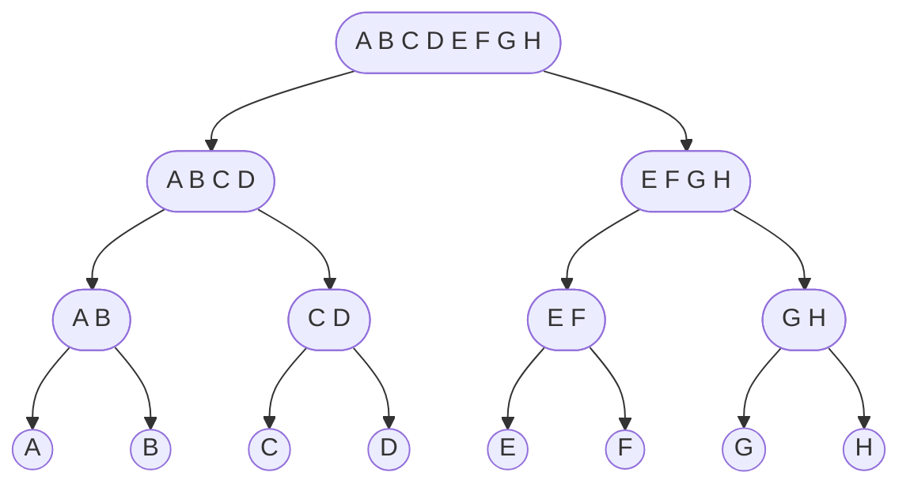

# Definizione 📃
Un algoritmo di tipo **Divide & Impera** è di tipo #ricorsivo ma particolare:

- #Divide: divide in sottoproblemi
- #Impera $\rightarrow$ `ricorsiva`: risolve i sottoproblemi
- #Combina: combina i sottoproblemi per ottenere la soluzione finale

>[!Important] Regola Fondamentale
>Risolvere **SEMPRE** prima la parte sinistra e poi quella destra, **MAI** in parallelo 

>[!Note]
>Un algoritmo di **D&I** lo si riconosce dal tempo del passo ricorsivo;
>es. 
>- $T(n) = T(\dfrac{2n}{3})$ è D&I? **Sì**, l'importanza della parte che tolgo non è collegata ad $n$
> - $T(n) = T(n-1000)$ **NON è** D&I

