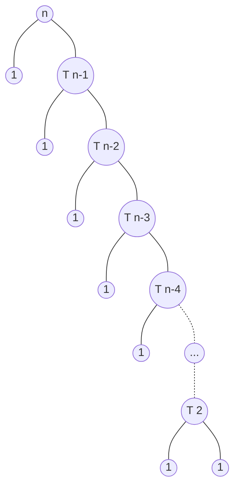

# Descrizione dell'Algoritmo 📃
L' #algoritmo di ordinamento Quick Sort utilizza il metodo [Divide & Impera](obsidian://open?vault=obsidian-git-sync&file=Algoritmi%20e%20Strutture%20Dati%2F1.%20%F0%9F%A7%91%E2%80%8D%F0%9F%92%BB%20Algoritmi%2F%F0%9F%9F%A3%20Divide%20%26%20Impera%2F%F0%9F%93%83%20Definizione%20Divide%20%26%20Impera):
- #Divide: **Partition** `(Hoare o Lomuto)`: partizionare l'array $A[In ... Fine]$ in due sottoarray $A[In ... m-1]$ e $A[m+1 ... Fine]$, tali che ogni elemento di $A[In ... m-1]$ sia minore o uguale ad $A[m]$, che a sua volta, sarà minore a ogni elemento di $A[m+1 ... Fine]$. Calcolare l'indice m, chiamato anche **pivot**, come parte di questa procedura di partizionamento;
- #Impera: ordina le `due` parti $A[In ... m-1]$ e $A[m+1 ... Fine]$ singolarmente richiamando #ricorsivamente il Quick Sort su di essi;
- #Combina: **NON c'è** nel Quick Sort, dato che i due sottoarray a questo punto saranno già ordinati;

>[!Note]
>- **NON STABILE**: i valori uguali **NON** mantengono l'ordine iniziale prestabilito;
>- **IN LOCO**: **NON** ho bisogno di alcune variabili di appoggio (*array*) al variare dell'input;

# Pseudocodice 🧬
``` Pseudocodice TI:"Partition_Lomuto" "FOLD"
void Partition_Lomuto(A[], In, Fine)
	pivot = A[Fine]
	i = In - 1
	for j = In to Fine - 1:
		if A[j] <= pivot:
			i++
			temp = A[i]
			A[i] = A[j]
			A[j] = temp
	temp = A[i+1]
	A[i+1] = A[Fine]
	A[Fine] = temp
	return i+1
```

``` Pseudocodice TI:"Partition_Hoare" "FOLD"
void Partition_Hoare(A[], In, Fine)
	pivot = A[In]
	sx = In - 1
	dx = Fine + 1
	while True:
		do
			sx++
		while A[sx] < pivot
		do
			dx++
		while A[dx] > pivot
		if sx > dx:
			return dx
		temp = A[sx]
		A[sx] = A[dx]
		A[dx] = temp
```

``` Pseudocodice TI:"Quick_Sort" "FOLD"
void Quick_Sort(A[], In, Fine)
	if In < Fine:
		m = Partition_X(A, In, Fine)         // Divide
		Quick_Sort(A, In, m-1)               // Impera
		Quick_Sort(A, m+1, Fine)             // Impera
```

# Complessità dell'algoritmo 🔬
- #### Tempo di Esecuzione ⌛
	- ##### Partition
		La funzione di #Partition ha un tempo di $θ(n)$;
		perchè:
		1. La prima procedura che esegue la Partition è identificare il pivot da utilizzare (nel caso di ***Lomuto*** è `l'ultimo elemento dell'array`);
			- il pivot (identificato come m) servirà per creare i due sottoarray ordinati $A[In ... m-1]$ e $A[m+1 ... Fine]$ tali che ogni elemento di $A[In ... m-1]$ sia minore o uguale ad $A[m]$, che a sua volta, sarà minore o uguale a ogni elemento di $A[m+1 ... Fine]$;
		2. Per fare ciò si dovranno utilizzare `due indici`, $i$ e $j$:
			- il primo sottoarray , che avrà tutti elementi minori o uguali ad $A[m]$ andrà da In a $i$;
			- il secondo sottoarray , che avrà tutti elementi maggiori ad $A[m]$ andrà da $i+1$ a $j-1$;
		3. Si utilizzerà un ciclo `for` che scorrerà $j$ dall'inizio alla fine dell'array **escluso il pivot**:
			- se l'elemento nella $j-esima$ posizione è **minore o uguale** al pivot, lo si dovrà aggiungere nel primo sottoarray, `scambiando` il $j-esimo$ elemento con il primo elemento del secondo sottoarray, quindi con l'$i+1-esimo$ elemento dell'array, e quindi $i$ verrà incrementato;
			- se l'elemento nella $j-esima$ posizione è **maggiore** al pivot, lo si aggiunge al secondo sottoarray semplicemente `continuando il ciclo e non scambiando nulla`, dato che gli elementi del secondo sottoarray vanno da $i+1$ a $j-1$, quindi $j$ verrà incrementato autonomamente dal ciclo;
		4. <mark style="background: #BBFABBA6;">Alla fine del ciclo avremo quindi</mark>, grazie agli indici $i$ e $j$, <mark style="background: #BBFABBA6;">tre partizioni</mark> :
			- $A[In ... m-1]$, $A[m+1 ... Fine]$ e il pivot $A[m]$ alla ultima posizione, sapenso che la prima sarà ≤ e la seconda > ad $A[m]$, mi basterà scambiare il primo elemento del secondo array ($i+1$) con il pivot, così da avere in ordine:$$A[In ... m-1], A[m],A[m+1 ... Fine]$$
		5. Infine si ritornerà la posizione del pivot, cioè $i+1$, così da avere un elemento m (`Divide`) da usare per la `Impera`.
		Da questi passaggi è facilmente intuibile che la **Partition** avrà un tempo di $θ(n)$, dato che il ciclo for scorrerà tutti gli elementi dell'*array*, ovvero $n$.

		<center></center>
	- ##### Quick Sort 
	>$T(n) =
	>\begin {cases} 
	>1 && \text n = 1 \\
	>T(m) + T(n-m) + θ(n) && \text n > 1\\
	>\end {cases}
	>$
	>- dove $m$ sono gli elementi della prima partizione e $n-m$ quelli della terza partizione.
	
	>[!Important]
	>L'array **NON** viene diviso perfettamente in 2 parti uguali, quindi si avrà un caso migliore e uno peggiore. 
***
- #### Caso Migliore 😃
>`Il partizionamento crea un taglio proporzionato`
$T(n) =
\begin {cases} 
1 && \text n = 1 \\
2·T(\dfrac{n}{2}) + θ(n) && \text n > 1\\
\end {cases}$
calcolandolo con il [metodo dell'esperto](obsidian://open?vault=obsidian-git-sync&file=Algoritmi%20e%20Strutture%20Dati%2F1.%20%F0%9F%A7%91%E2%80%8D%F0%9F%92%BB%20Algoritmi%2F%F0%9F%9F%A3%20Divide%20%26%20Impera%2F%F0%9F%A4%93%20Metodo%20dell'Esperto):
$T_{migliore}(n)$ = -> $Ω(n\log n)$

>[!Note] 
>Questo tempo ha la stessa equazione del [Merge Sort](obsidian://open?vault=obsidian-git-sync&file=Algoritmi%20e%20Strutture%20Dati%2F1.%20%F0%9F%A7%91%E2%80%8D%F0%9F%92%BB%20Algoritmi%2F%F0%9F%9F%A4%20Sorting%2F4.%20Merge%20Sort%20(D%26I))
- #### Caso Peggiore 😱
>`Più il taglio sarà sproporzionato, più i tempi aumenteranno`
$
T(n) =
\begin {cases} 
1 && \text n = 1 \\
T(1) + T(n-1) + θ(n) && \text n > 1\\
\end {cases}
$

calcolando il tempo con il metodo di [albero di ricorsione](obsidian://open?vault=obsidian-git-sync&file=Algoritmi%20e%20Strutture%20Dati%2F1.%20%F0%9F%A7%91%E2%80%8D%F0%9F%92%BB%20Algoritmi%2F%F0%9F%9F%A2%20Ricorsione%2F%F0%9F%94%A2%20Calcolare%20i%20tempi%20Ricorsivi):

la profondità dell'albero è $n$ quindi:
>$T(n) = n+n+(n-1)+(n-2)+(n-3)+...+3+2 = n+2+3+...+(n-2)+(n-1)+n$
$= n + \sum\limits_{i = 2}^{n} {i} = n+\dfrac{(n+1) · n}{2}$ ⁓ $θ(n^2)$
$T_{peggiore}(n)$ $\Rightarrow$ $O(n^2)$

- #### Caso Generale 🤔
Proviamo a ragionare sul caso medio. Il conto corretto andrebbe fatto valutando la distribuzione di probabilità dell'input. Vogliamo almeno domandarci: quasi sempre impiega $θ(n\log n)$ o $θ(n^2)$? Ipotizziamo questo albero.

<center></center>

per valutare il calcolo bisogna sommare i costi di ogni livello; da questo albero è facile intuire che $n$ viene ripetuto tante volte quanto la profondità dell'albero che è $logaritmica$, di preciso considerando il caso base del ramo più a destra:
- $(\dfrac{9}{10})^k·n = \dfrac{n}{(\dfrac{10}{9})^k} = 1$ $\Rightarrow$ $n = (\dfrac{10}{9})^k$ $\Rightarrow$ $k=\log_{\cfrac{10}{9}}n$
quindi il tempo totale sarà:
- $T(n) = n·\log_{\cfrac{10}{9}}n = θ(n·\log n)$
Questo mostra che anche se i tagli sono sbilanciati (ma restano una frazione) il tempo tende a restare $n·\log n$. In generale abbiamo un po' di esecuzioni con tempo $n$, ma il tempo rimanente sarà $n·\log n$. 
Questo porta l'algoritmo ad essere asintotico a $θ(n·\log n)$.

> [!Summary]
> - ***Caso migliore***: $Ω(n\log n)$
> - ***Caso Medio***: $θ(n\log n)$
> - ***Caso peggiore***: $O(n^2)$

# Codice dell'Algoritmo 🐍
```PYTHON TI:"Partition_Lomuto" "FOLD"
def Partition_Lomuto(A, In, Fine):
    pivot = A[Fine]
    i = In - 1
    for j in range(In, Fine):
        if A[j] <= pivot:
            i += 1
            temp = A[i]
            A[i] = A[j]
            A[j] = temp
    temp = A[i+1]
    A[i+1] = A[Fine]
    A[Fine] = temp
    return i + 1
```
```PYTHON TI:"Partition_Hoare" "FOLD"
def Partition_Hoare(A, In, Fine):
    pivot = A[In]
    i = In - 1
    j = Fine + 1
    first_iter = True
    while (True):
        i += 1
        while (A[i] < pivot):
            i += 1
            
        j -= 1
        while (A[j] > pivot):
            j -= 1
            
        if (i >= j):
	        return j
	        
		temp = A[i]
		A[i] = A[j]
		A[j] = temp
```
```PYTHON TI:"Quick_Sort" "FOLD"
def Quick_Sort(A, In, Fine):
    if In < Fine:
        m = Partition_X(A, In, Fine)
        Quick_Sort(A, In, m-1)
        Quick_Sort(A, m+1, Fine)
```

# Simulazione dell'Algoritmo ⚙️
<center>

</center>
