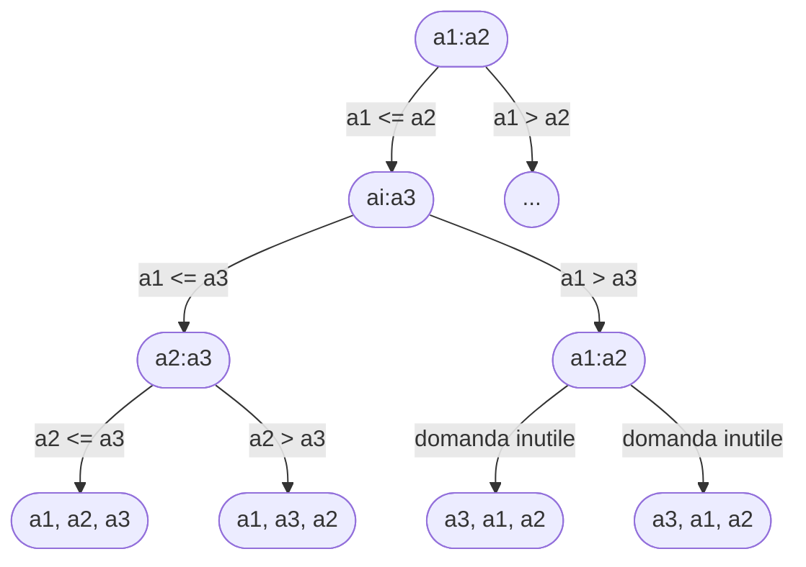

# Esiste un algoritmo che ordina un array in tempo minore a $n·\log n$?
- Per mostrare che **non esiste**, devo dimostrare che tutti i possibili algoritmi di ordinamento richiedono almeno $n·\log n$.
- <mark style="background: #BBFABBA6;">Dimostriamo che qualunque algoritmo che si basa sui confronti richiede almeno $n·\log n$ per ordinare</mark> . Si può dimostrare usando gli alberi di decisione (albero binario dove ogni etichetta rappresenta una domanda a cui può essere data risposta vera o falsa):

- Considero un **albero di decisione** di altezza $h$ con $l$ foglie raggiungibili che corrisponde a un ordinamento per confronti di $n$ elementi;
- <mark style="background: #BBFABBA6;">Possibili ordinamenti di un array di $n$ elementi $= n!$</mark>;
- Poichè ciascuna delle $n!$ permutazioni dell'input compare in una foglia, si ha $n!≤l$. Dal momento che un albero binario di altezza $h$ non ha più di $2^h$ foglie, si ha:
$$n!≤l≤2^h$$
- Servono quindi almeno $n!$ foglie:
	- occorre:
		$2^h≥n! = h ≥ \log_2(n!)$
		$n! = \sqrt{2πn}·(\dfrac{n}{e})^n·(1+θ(\dfrac{1}{n}))$ -> `(Stirling)`
		$n!$ ≥ $(\dfrac{n}{e})^n$ 
		=> $h ≥ \log_2(n!)$ ⁓ $\log_2(\dfrac{n}{e})^n = \log_2(\dfrac{n^n}{e^n}) = n·\log_2{n}-n·\log_2{e} = θ(n·\log {n})$
- Concludo che il tempo minomo un algoritmo che si basa sui confronti richiede minimo tempo $θ(n·\log {n})$.