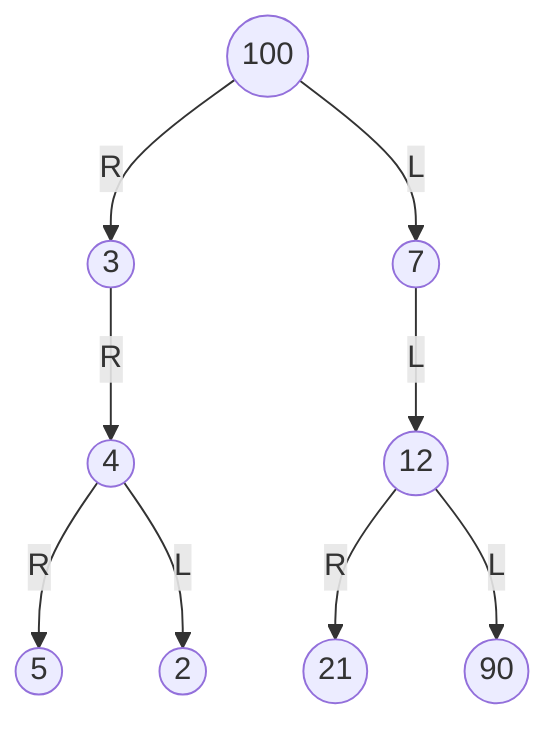

Avendo il seguente albero binario:

```mermaid
graph TB; 
i1((100))
i2((3))
i3((7))
i4((4))
i5((12))
i6((5))
i7((2))
i8((21))
i9((90))
i1 --R--> i2
i1 --L--> i3
i2 --R--> i4
i4 --R--> i6
i4 --L--> i7
i3 --L--> i5
i5 --R--> i8
i5 --L--> i9
```

Si può attraversare l'albero in 3 modi:
- 