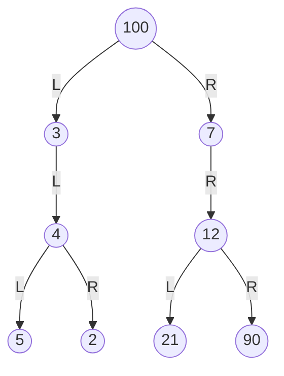

Avendo il seguente albero binario:

Si può attraversare l'albero in 3 modi:
- **pre-order** $\rightarrow$ vLR
- **in-order** $\rightarrow$ LvR
- **post-order** $\rightarrow$ LRv
***
Avendo così:

>- pre-order $\rightarrow$ 100, (3, (4, (5, 2))), (7, (12, (21, 90))) = 100, 3, 4, 5, 2, 7, 12, 21, 90
>- in-order $\rightarrow$ ((5, (4), 2), 3), 100, ((7), (21, (12), 90)) = 5, 2, 

