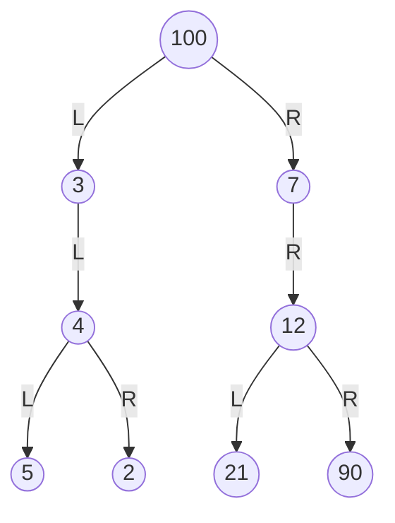
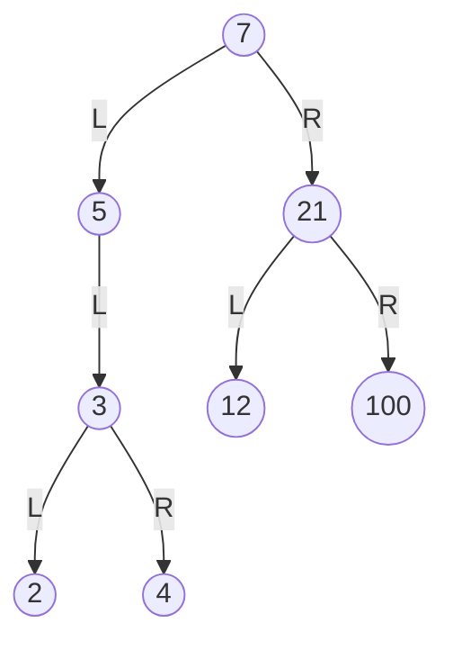

Avendo il seguente albero binario:



Si può attraversare l'albero in 3 modi:
- **pre-order** $\rightarrow$ vLR
- **in-order** $\rightarrow$ LvR
- **post-order** $\rightarrow$ LRv

Avendo così:

>- pre-order $\rightarrow$ 100, (3, (4, (5, 2))), (7, (12, (21, 90))) = 100, 3, 4, 5, 2, 7, 12, 21, 90
>- in-order $\rightarrow$ ((5, (4), 2), 3), 100, ((7), (21, (12), 90)) = 5, 4, 2, 3, 100, 7, 21, 12, 90
>- post-order $\rightarrow$ ((5, 2, (4)), 3), ((21, 90, (12)), 7), 100 = 5, 2, 4, 3, 21, 90, 12, 7
***



È un albero binario di ricerca? Sì
- in-order: ((2, (3), 4), 5), 7, (12, (21), 100) = 2, 3, 4, 5, 7, 12, 21, 100

>[!Important]
>La visita in-order di un albero binario di ricerca dà come risultato i valori dei nodi in ordine crescente.

***

- ### Pre-Order
``` Pseudocodice TI:"In_Order" "FOLD"
// chiamata: Pre_Order(T.root)
boolean Pre_Order(pT)
	if pT != Null:
		print(pT.key)           // v
		Pre_Order(pT.left)      // L
		Pre_Order(pT.right)     // R
```

- ### In-Order
``` Pseudocodice TI:"In_Order" "FOLD"
// chiamata: In_Order(T.root)
boolean In_Order(pT)
	if pT != Null:
		In_Order(pT.left)       // L
		print(pT.key)           // v
		In_Order(pT.right)      // R
```

- ### Post-Order
``` Pseudocodice TI:"In_Order" "FOLD"
// chiamata: Post_Order(T.root)
boolean Post_Order(pT)
	if pT != Null:
		Post_Order(pT.left)     // L
		Post_Order(pT.right)    // R
		print(pT.key)           // v
```