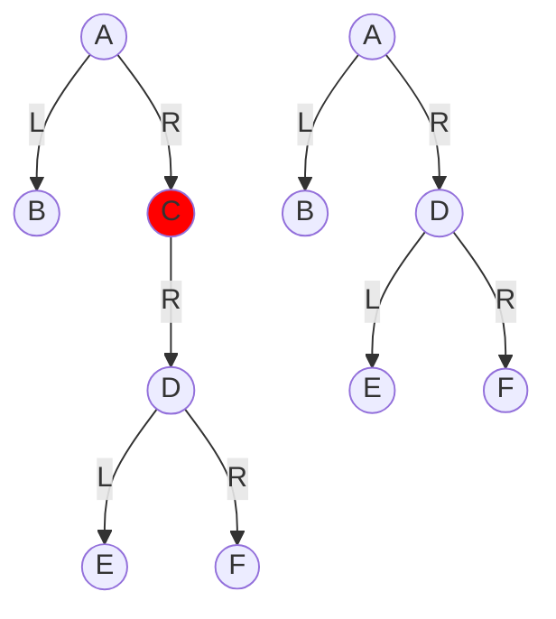

>[!Important] 
>Il tempo di tutte le operazioni di un albero dipendono dalla sua altezza.
>- Se l'albero è ben bilanciato, tutte le operazioni richiedono tempo logaritmico.

- ### Ricerca
Cercare un elemento k dato un albero binario di ricerca $T$.
``` Pseudocodice TI:"SBT_Search" "FOLD"
// chiamata: SBT_Search(T.root, k)
<type> SBT_Search(x, k)
	if x == Null or x.key == k:
		return x
	else:
		if x.key > k:
			return SBT_Search(x.left, k)
		else:
			return SBT_Search(x.right, k)
```

>- $T_{migliore}(n) = 3c \Rightarrow Ω(1) \rightarrow$ $k=T.root$
>- $T_{peggiore}(n) \Rightarrow O(h) \rightarrow$ $k\notin T$ e percorro il ramo più lungo (altezza dell'albero, quindi avrò un tempo di $O(\log n)$ nel caso $T$ sia ben bilanciato, e un tempo di $O(n)$ nel caso $T$ sia sbilanciato).

- ### Minimo/Massimo dell'Albero
	- Il **minimo** in un SBT (Serach Binary Tree), è l'elemento più a sinistra dell'albero che non ha figlio sinistro
	- Analogalmente, il **massimo** in un SBT (Serach Binary Tree), è l'elemento più a destra dell'albero che non ha figlio destro

``` Pseudocodice TI:"SBT_Min" "FOLD"
<type> SBT_Min(x)
	if x != Null:
		while x.left != Null:
			x = x.left
	return x
```

>- $T_{migliore}(n) \Rightarrow Ω(1) \rightarrow$ la radice non ha figli sinistri
>- $T_{peggiore}(n) \Rightarrow O(h) \rightarrow$ il minimo è il ramo più grande dell'albero

``` Pseudocodice TI:"SBT_Max" "FOLD"
<type> SBT_Max(x)
	if x != Null:
		while x.right != Null:
			x = x.right
	return x
```

>- $T_{migliore}(n) \Rightarrow Ω(1) \rightarrow$ la radice non ha figli destri
>- $T_{peggiore}(n) \Rightarrow O(h) \rightarrow$ il massimo è il ramo più grande dell'albero

- ### Successore/Predecessore di $x$
	- Il **successore** di un nodo $x$ è il più piccolo tra tutti quelli più grandi di lui, quindi ho due casi:
		- o il successore è il minimo dell'albero $x.right$;
		- se $x.right = Null$ allora il suo successore lo troverò risalendo finchè non troverò un $p=p.parent.left$ o $p.parent=Null$, ovvero finchè risalendo verso l'alto non trovo una diramazione che va verso destra o nel caso non si trovi, $x$ non avrà un successore.
	- Analogalmente, il **predecessore** di un nodo $x$ è il più grande tra tutti quelli più piccoli di lui, quindi come prima avrò due casi:
		- o il predecessore è il massimo dell'albero $x.left$;
		- se $x.left = Null$ allora il suo predecessore lo troverò risalendo finchè non troverò un $p=p.parent.right$ o $p.parent=Null$, ovvero finchè risalendo verso l'alto non trovo una diramazione che va verso sinistra o nel caso non si trovi, $x$ non avrà un predecessore.
	

``` Pseudocodice TI:"SBT_Succ" "FOLD"
<type> SBT_Succ(x)
	if x.right != Null:
		return SBT_Min(x.right)
	else:
		while x.parent != Null and x != x.parent.left:
			x = x.parent    //risalgo
		return x.parent
```

>- $T_{migliore}(n) \Rightarrow Ω(1) \rightarrow$ la radice dell'albero $x.right$ non ha figli sinistri
>- $T_{peggiore}(n) \Rightarrow O(h) \rightarrow$ devo risalire ma $x$ è il massimo

``` Pseudocodice TI:"SBT_Pred" "FOLD"
<type> SBT_Pred(x)
	if x.right != Null:
		return SBT_Max(x.left)
	else:
		while x.parent != Null and x != x.parent.right:
			Patt = x.parent    //risalgo
		return x.parent
```

>- $T_{migliore}(n) \Rightarrow Ω(1) \rightarrow$ la radice dell'albero $x.left$ non ha figli destri
>- $T_{peggiore}(n) \Rightarrow O(h) \rightarrow$ devo risalire ma $x$ è il minimo

- ### Insert
##### Iterativo
Inserimento di un elemento $z$ in un albero di ricerca.
``` Pseudocodice TI:"SBT_Insert" "FOLD"
<type> SBT_Insert(T, z)
	if T.root == Null:
		T.root = z
	else:
		P = T.root
		Papp = Null
		while P != Null:
			Papp = P
			if z.key <= P.key
				P = P.left
			else:
				P = P.right
		if z.key <= Papp.key
			Papp.left = z
		else:
			Papp.right = z
		z.parent = Papp
```

>- $T(n) \Rightarrow θ(h)$

##### Ricorsivo
Inserimento di un elemento $z$ in un albero di ricerca ricorsivamente

``` Pseudocodice TI:"SBT_Insert_Recurvive" "FOLD"
// chiamata: SBT_Insert_Recurvive(T.root, x)
void SBT_Insert_Recurvive(P, z)
	if P == Null:
		P = x
	if x.key <= P.key and P.left == Null:
		P.left == x
	if x.key > P.key and P.right == Null:	
		P.right == x
	else:
		if x.key <= P.key:
			 SBT_Insert(P.left, x)
		else:
			 SBT_Insert(P.right, x)
```
oppure
``` Pseudocodice TI:"SBT_Insert_Recurvive" "FOLD"
// chiamata: SBT_Insert_Recurvive(T.root, x)
<type> SBT_Insert_Recurvive(P, x)
	if P == Null:
		if P.parent == Null:
			P = x
		else:
			return x
	else:
		if x.key <= P.key:
			 P.left = SBT_Insert(P.left, x)
		else:
			 P.right = SBT_Insert(P.right, x)
		return P
```

>- $T_{migliore}(n) \Rightarrow Ω(1) \rightarrow$ l'albero è vuoto e $x$ diventerà la radice
>- $T_{peggiore}(n) \Rightarrow O(h) \rightarrow$ dovrò scorrere il ramo più lungo dell'albero per inserire $x$

- ### Delete
	Cancellazione di un elemento da un albero di ricerca. 
	Distinguiamo tre casi:
1. **elemento foglia** (più semplice: elimino e basta).
2. **elemento con un solo figlio** (sostituiamo con il sottoalbero avente come radice l'unico figlio; tale operazione è detta "contrazione"). 



3. **elemento con entrambi i figli**. Trovo il minimo del sottoalbero destro (oppure il massimo del sottoalbero sinistro) per ottenere il successore (rispettivamente, il predecessore); scambio i due valori. A quel punto il problema si riduce a cancellare il nodo dove c'era il successore che ricade obbligatoriamente nei due casi precedenti.

``` Pseudocodice TI:"SBT_Del" "FOLD"
<type> SBT_Del(T, x)
	if x.left == Null and x.right == Null:         // caso 1
		if x.parent = Null:                        // è la radice
			T.root = Null
		else:
			if x = x.parent.left:                  // figlio sx
				x.parent.left = Null
			else:
				x.parent.right = Null
	else if x.left == Null xor x.right == Null    // caso 2
		contrazione(T, x)
	else:
		
```