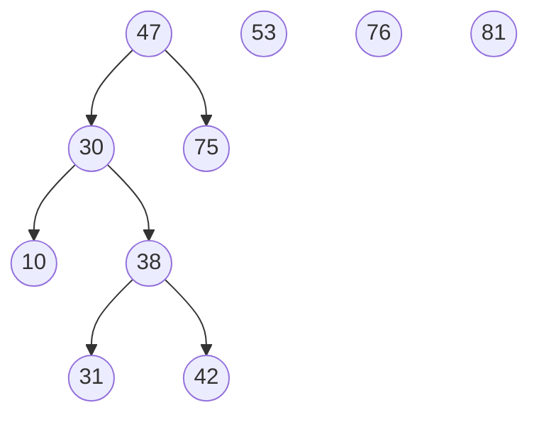

# Esercizio ⛏️  
Data la seguente struttura, inserire valori affinché risulti un BST. 
[10, 75, 30, 42, 47, 81, 38, 31, 76, 53]
- se non è richiesto di mettere un elemento alla volta allora:
	- ordino gli elementi:
		- [10, 30, 31, 38, 42, 47, 53, 75, 76, 81]
	- prendo la metà come radice e creo l'albero così che sarà bilanciato

