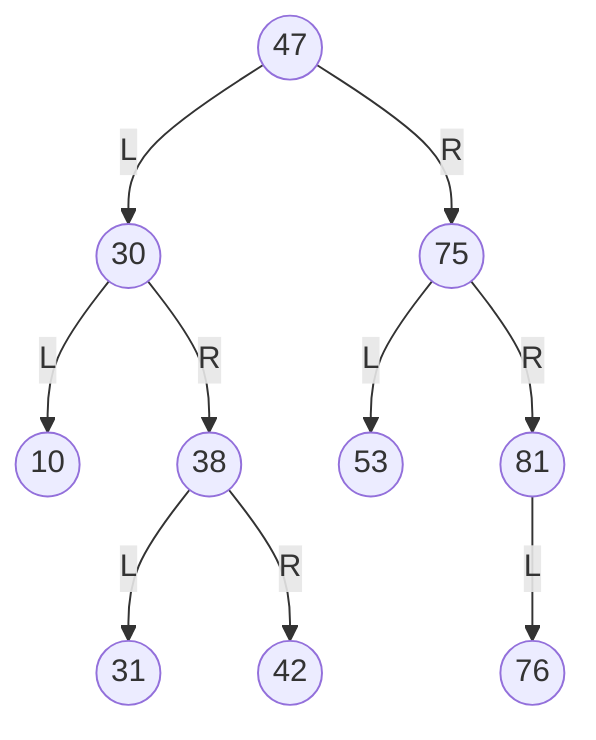
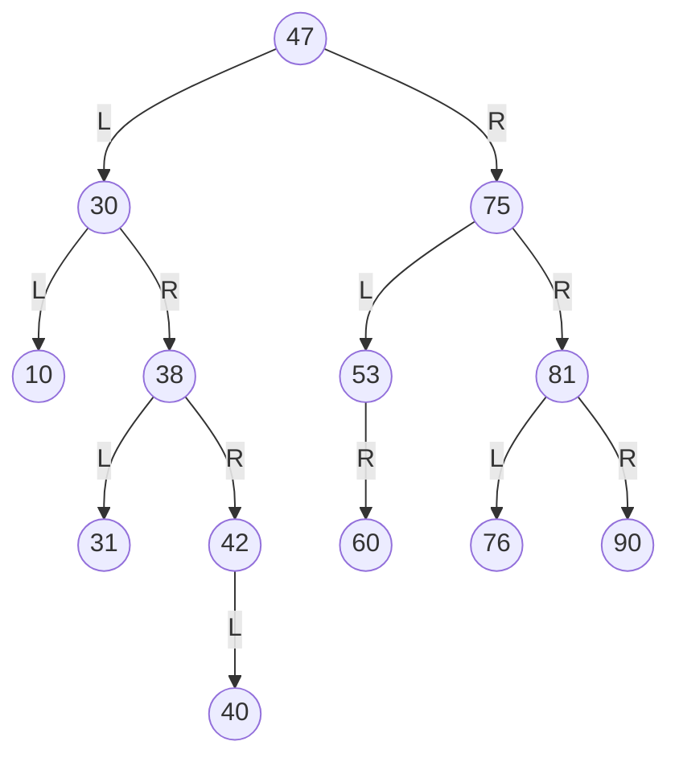

# Esercizio ⛏️  
1. Data la seguente struttura, inserire valori affinché risulti un BST. 
[10, 75, 30, 42, 47, 81, 38, 31, 76, 53]
- se non è richiesto di mettere un elemento alla volta allora:
	- ordino gli elementi:
		- [10, 30, 31, 38, 42, 47, 53, 75, 76, 81]
	- prendo la metà come radice e creo l'albero così che sarà bilanciato

2. Inserire quindi uno alla volta i valori 40 60 90
	- 40<47 $\rightarrow$ 40>30 $\rightarrow$ 40>38 $\rightarrow$ 40<42: inserisco 40 a sx di 42
	- 60>47 $\rightarrow$ 60<75 $\rightarrow$ 60>53: inserico 60 a dx di 53
	- 90>47 $\rightarrow$ 90>75 $\rightarrow$ 90>81: inserisco 90 a dx di 81

