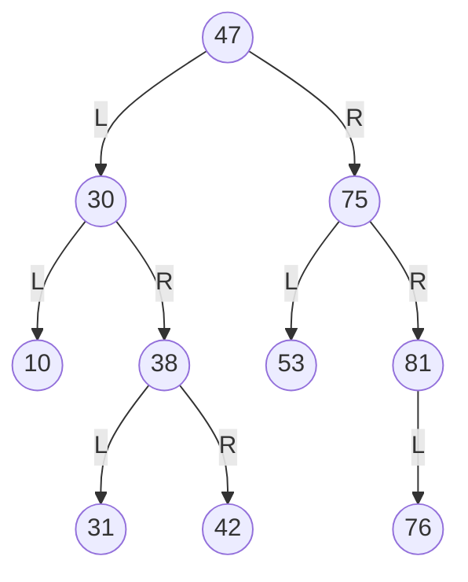
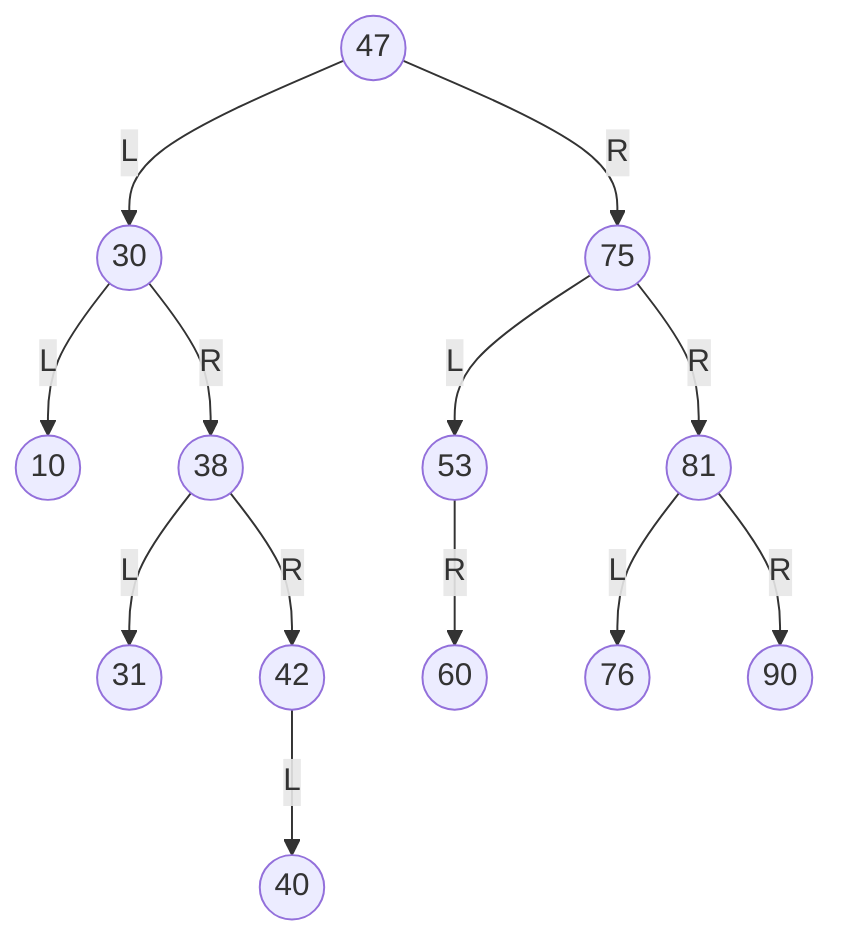
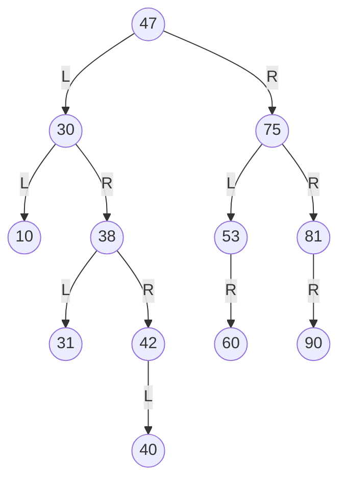
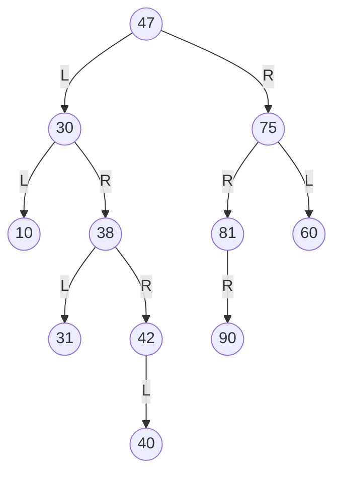
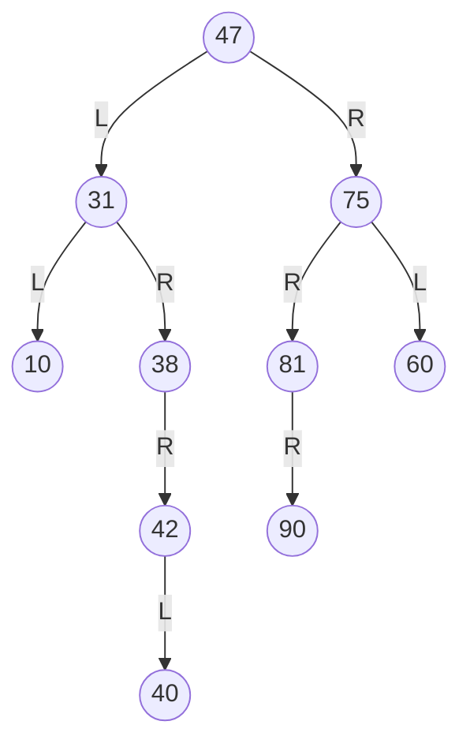

# Esercizio ⛏️  
1. Data la seguente struttura, inserire valori affinché risulti un BST. 
[10, 75, 30, 42, 47, 81, 38, 31, 76, 53]
- se non è richiesto di mettere un elemento alla volta allora:
	- ordino gli elementi:
		- [10, 30, 31, 38, 42, 47, 53, 75, 76, 81]
	- prendo la metà come radice e creo l'albero così che sarà bilanciato



2. Inserire quindi uno alla volta i valori 40 60 90
	- 40<47 $\rightarrow$ 40>30 $\rightarrow$ 40>38 $\rightarrow$ 40<42: inserisco 40 a sx di 42
	- 60>47 $\rightarrow$ 60<75 $\rightarrow$ 60>53: inserico 60 a dx di 53
	- 90>47 $\rightarrow$ 90>75 $\rightarrow$ 90>81: inserisco 90 a dx di 81


3. Cancellare quindi uno alla volta i valori 76, 53, 30
- Del. 76
	- caso 1:
		- Del 76

- Del. 53
	- caso 2:
		- sostituisco 53 con il suo ramo destro (contrazione)

- Del. 30
	- caso 3
		- Succ di 30 = 31
		- 30 = 31
		- Del 31

Stampare i nodi seguendo le diverse visite.
- **pre-order**: 47, 31, 10, 38, 42, 40, 75, 60, 81, 90
- **in-order**: 10, 31, 38, 40, 42, 47, 60, 75, 81, 90
- **post-order**: 10, 40, 42, 38, 31, 60, 90, 81, 75, 47
***
- ### Albero D&I
Dato un albero binario a valori interi, scrivere un algoritmo divide et impera che conti i valori nell'albero che sono compresi tra $n1$ e $n2$.
Valutare i tempi di esecuzione considerando in input un albero completo.

``` Pseudocodice TI:"func" "FOLD"
// chiamata: func(T.root, n1, n2)
int func(x, n1, n2):
	if x == Null:
		return 0
	else:
		sx = func(x.left, n1, n2)
		dx = func(x.right, n1, n2)
		if x >= n1 and x <= n2:
			return 1 + sx + dx
		else:
			return sx + dx
```

>$T(n)$ = $
\begin {cases} 
2 && \text n = 0 \\
2T(\dfrac{n}{2})+2 && \text n>0\\
\end {cases}
$
>- con [metodo dell'esperto](obsidian://open?vault=obsidian-git-sync&file=Algoritmi%20e%20Strutture%20Dati%2F1.%20%F0%9F%A7%91%E2%80%8D%F0%9F%92%BB%20Algoritmi%2F%F0%9F%9F%A3%20Divide%20%26%20Impera%2F%F0%9F%A4%93%20Metodo%20dell'Esperto):
>	- $a=2, b=2$
>	- $f(n)=2$
>	- $n^{\log_b a} = n^{\log_2 2} = n$
>	- $\Rightarrow$ `caso 1` $\rightarrow$ $2=O(n^{1-ε})$? Sì, $ε=\cfrac{1}{2}$
>	- $T(n) = θ(n)$

- ### Ordina Array e Albero
Dato un SBT con $n$ interi distinti e un vettore ordinato con $m$ interi distinti, stampare i valori in ordine crescente. Implementare il tipo di dati insieme.

``` Pseudocodice TI:"func" "FOLD"
int func(T, A):
	i = 1
	x = SBT_Min(T.root)
	while i <= length(A) and x != Null:
		if A[i] < x.key:
			print(A[i])
			i++
		else if A[i] > x.key:
			print(x.key)
			x = SBT_Succ(x)
		else:
			print(A[i])
			print(x.key)
			i++
			x = SBT_Succ(x)
		// uno dei due sarà vuoto
		while i <= length(A):
			print(A[i])
			i++
		while x != Null:
			print(x.key)
			x = SBT_Succ(x)
```

>[!Warning]
>Il tempo può sembrare $n+m$, ma **ATTENZIONE**, si stanno utilizzando funzioni quali SBT_Min() e SBT_Succ():
>- Per trovare il minimo nell'albero il tempo va da $Ω(1)$ se la radice non ha figli sinistri, $O(\log n)$  se scorro il nodo più lungo e quindi scorro l'altezza dell'albero.
>- Per trovare il successore di un nodo il tempo va da $Ω(1)$ se la radice dell'albero $x.right$ non ha figli sinistri, $O(\log n)$ se $x$ è il massimo e risalgo per tutta l'altezza dell'albero.

>Scorrerò tutti gli $m$ elementi dell'array + tutti gli $n$ elementi dell'albero, però per ogni $n$ dovrò trovare il successore di $x$, quindi $n·\log n$.
>$T(n, m) = θ(n\log n+m)$