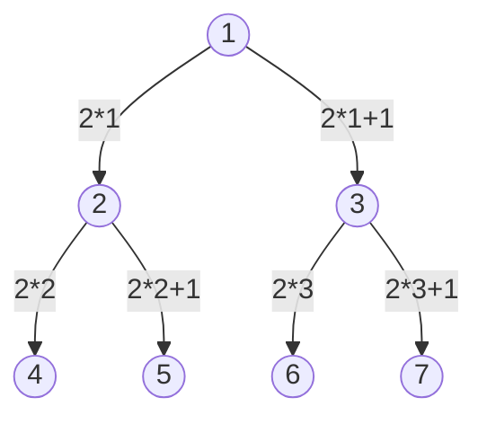

Uno degli usi degli Heap è per implementare code di priorità, oppure per l'algoritmo di ordinamento Heap Sort (descritto in [[8. Heap Sort]]).
***
# Descrizione della Struttura 📃
Uno Heap è un array $A$ che è visto però come un albero binario quasi completo.
- <mark style="background: #BBFABBA6;">È un albero binario completo</mark> a meno dell'ultimo livello, riempito comunque a partire da sinistra.
- Il nodo $i$, ha come figli i nodi $2i$ e $2i+1$ ($i$ è l'indice dell'array).
	- es. 
		- dato un array: [1, 2, 3, 4, 5, 6, 7]
- $i.parent = int(\dfrac{i}{2})$

>[!Important] Proprietà
>In uno heap i due figli di un nodo $i$ sono minori o uguali di $i$:
>- $\forall$ elemento $i$:
>	- $i.left≤i$
>	- $i.right≤i$
>
>- Possiamo dire con certezza che il primo elemento (**la radice**) è il **massimo**.

- L'**altezza** di uno heap è $θ(\log n)$;
- $length(A)$: lunghezza dell'array;
- $heapsize(A)$: quanti elementi dell'array formano lo heap;

>[!Note]
>- $0≤heapsize(A)≤length(A)$;
>- Heapsize è dinamico e indica quanti elementi fanno parte dello heap;
>-  $heapsize$ varia in fase di esecuzione;

***

Le funzioni principali dello heap sono:
- **Heapify($A, i$)**
	- assume che $i.left$ e $i.right$ siano degli heap, ma $A[i]$ può essere più piccolo dei proprio figli.
	- Se questo è il caso, la procedura fa scivolare l’elemento $A[i]$ lungo un cammino dell’albero in modo da ristabilire la proprietà degli heap.

>### Esempio Grafico
>

>
> Questo grafico rappresenta la chiamata alla funzione Heapify$(A, 2)$:
> **a)** La configurazione iniziale con $A[2]$ nel nodo $i=2$ viola la proprietà dello heap; 
> **b)** La proprietà dello heap viene ripristinata nel nodo $2$ scambiandolo $A[2]$ con $A[4]$, ma questo distrugge la proprietà la proprietà dello heap nel nodo $4$.
> La chiamata ricorsiva Heapify$(A, 4)$ adesso ha $i=4$.
> Dopo aver scambiato $A[4]$ con $A[9]$ 

- **BuildHeap($A$)**:
	- Da un array disordinato ottengo uno heap;