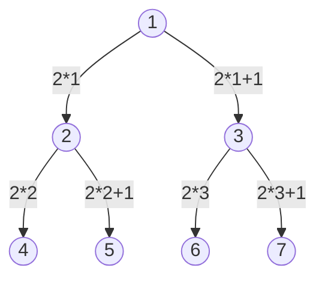

Uno degli usi degli Heap è per implementare code di priorità, oppure per l'algoritmo di ordinamento [[8. Heap Sort]].
***
# Descrizione della Struttura 📃
Uno Heap è un array $A$ che è visto però come un albero binario quasi completo.
- <mark style="background: #BBFABBA6;">È un albero binario completo</mark> a meno dell'ultimo livello, riempito comunque a partire da sinistra.
- Il nodo $i$, ha come figli i nodi $2i$ e $2i+1$ ($i$ è l'indice dell'array).
	- es. 
		- dato un array: [1, 2, 3, 4, 5, 6, 7]
- $i.parent = int(\dfrac{i}{2})$

>[!Important] Proprietà
>In uno heap i due figli di un nodo $i$ sono minori o uguali di $i$:
>- $\forall$ elemento $i$:
>	- $i.left≤i$
>	- $i.right≤i$
>
>- Possiamo dire con certezza che il primo elemento (**la radice**) è il **massimo**.

- L'**altezza** di uno heap è $θ(\log n)$;
- $A.length$: lunghezza dell'array;
- $A.heapsize$: quanti elementi dell'array formano lo heap;

>[!Note]
>- $0≤heapsize(A)≤length(A)$;
>- Heapsize è dinamico e indica quanti elementi fanno parte dello heap;
>-  $heapsize$ varia in fase di esecuzione;

- Dato uno heap con $n$ nodi avrò:
		- $roof(\dfrac{n}{2})$ foglie;
		- $floor(\dfrac{n}{2})$ non foglie;

>[!Note]
>Consultare il significato di $floor()$ e $roof()$ in [[D. Approssimazioni]]