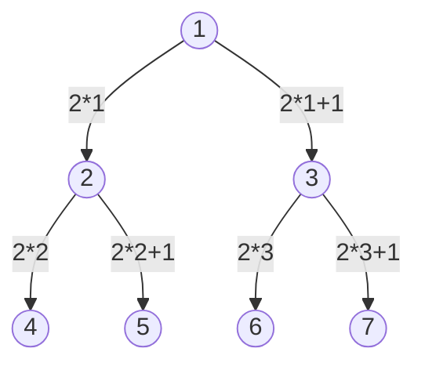

Uno degli usi degli Heap è per implementare code di priorità, oppure per l'algoritmo di ordinamento Heap Sort (descritto in [[8. Heap Sort]]).
***
# Descrizione della Struttura 📃
Uno Heap è un array che è visto però come un albero binario quasi completo.
- È un albero binario completo a meno dell'ultimo livello, riempito comunque a partire da sinistra.
- Il nodo $i$, ha come figli i nodi $2i$ e $2i+1$ ($i$ è l'indice dell'array).
	- es. 
		- dato un array: [1, 2, 3, 4, 5, 6, 7]

