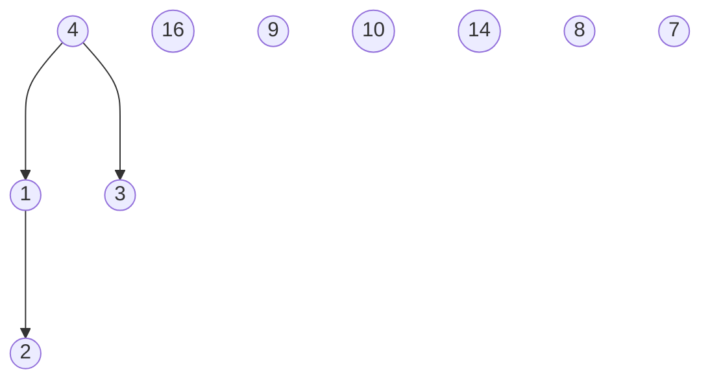

- ### Heapify($A, i$)
	- assume che $i.left$ e $i.right$ siano degli heap, ma $A[i]$ può essere più piccolo dei proprio figli.
	- Se questo è il caso, la procedura fa scivolare l’elemento $A[i]$ lungo un cammino dell’albero in modo da ristabilire la proprietà degli heap.

``` Pseudocodice TI:"Heapify" "FOLD"
void Heapify(A, i)
	l = i * 2
	r = (i * 2) + 1
	max = i
	if l <= A.heapsize and A[l] > A[max]:
		max = l
	if r <= A.heapsize and A[r] > A[max]:
		max = r
	if max != i:
		temp = A[i]
		A[i] = A[max]
		A[max] = temp
		Heapify(A, max)
``` 

>Il tempo di esecuzione si Heapify$(A, i)$ in un sottoalbero di dimensione $n$ con radice in un nodo $i$ è pari al tempo $θ(1)$ per sistemare il massimo tra $i$ e i suoi due figli destro e sinistro, **più** il tempo per eseguire un **Heapify** in un sottoalbero con radice in uno dei due figli del nodo $i$, se $i$ non è il massimo tra $i$ stesso e i suoi due figli.
>**N.B**: i sottoalberi dei due figli hanno una dimensione che non supera $\dfrac{2n}{3}$. 
>- $T_{migliore}(n) = 3c + 2c + 1c \Rightarrow Ω(1) \rightarrow$ $max$ rimane $i$ oppure $i$ non ha figli
>- $T_{peggiore}(n) = T(\dfrac{2n}{3})+θ(1) \Rightarrow O(\log n) \rightarrow$ viene eseguita la chiamata alla radice e scorrerò tutta l'altezza dell'albero, eseguendo la chiamata ricorsiva fino ad arrivare a una foglia.  

<br>

>### Esempio Grafico
><center></center>
>
> Questo grafico rappresenta la chiamata alla funzione Heapify$(A, 2)$:
> **a)** La configurazione iniziale con $A[2]$ nel nodo $i=2$ viola la proprietà dello heap; 
> **b)** La proprietà dello heap viene ripristinata nel nodo $2$ scambiandolo $A[2]$ con $A[4]$, ma questo distrugge la proprietà la proprietà dello heap nel nodo $4$. La chiamata ricorsiva Heapify$(A, 4)$ adesso ha $i=4$.
> **c)** Dopo aver scambiato $A[4]$ con $A[9]$ il nodo $4$ è sistemato e la chiamata ricorsiva Heapify$(A, 9)$ non apporterà ulteriori modifiche.

***

- Dato l'array $[4, 1, 3, 2, 16, 9, 10, 14, 8, 7]$ costruire lo heap.
