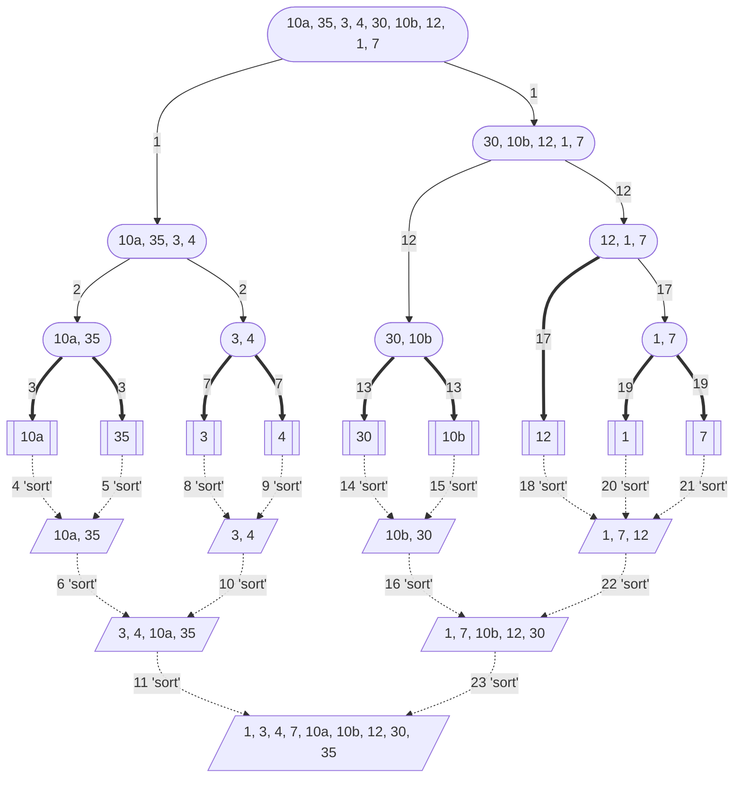

# Descrizione dell'Algoritmo 📃
L' #algoritmo di ordinamento Merge Sort utilizza il metodo [Divide & Impera](obsidian://open?vault=obsidian-git-sync&file=Algoritmi%20e%20Strutture%20Dati%2F1.%20%F0%9F%A7%91%E2%80%8D%F0%9F%92%BB%20Algoritmi%2F%F0%9F%9F%A3%20Divide%20%26%20Impera%2F%F0%9F%93%83%20Definizione%20Divide%20%26%20Impera):
- #Divide: divido in `due` parti l'array (logicamente);
- #Impera: ordina le `due` parti singolarmente;
- #Combina: fondo i due sottoarray ordinati;
>[!Note]
>- **STABILE**: i valori uguali mantengono l'ordine iniziale prestabilito;
>- **NON IN LOCO**: ho bisogno di alcune variabili di appoggio (*array*) al variare dell'input;
- Di seguito è presente l'intero procedimento per effettuare un ordinamento di Merge Sort con un array:

Concettualmente, l'algoritmo funziona nel seguente modo:
1.  Se la sequenza da ordinare ha lunghezza $0$ oppure $1$, è già ordinata. 
	Altrimenti:
1.  La sequenza viene divisa `(divide)` in due metà (se la sequenza contiene un numero dispari di elementi, viene divisa in due sottosequenze di cui la prima ha un elemento in più della seconda);
2.  Ognuna di queste sottosequenze viene ordinata, applicando #ricorsivamente  l'algoritmo `(impera)`;
3.  Le due sottosequenze ordinate vengono fuse `(combina)`. Per fare questo, si estrae ripetutamente il minimo delle due sottosequenze e lo si pone nella sequenza in uscita, che risulterà ordinata;

# Pseudocodice 🧬
``` Pseudocodice TI:"Merge" "FOLD"
void Merge(A[], In, medio, Fine)
	i = In                   // indice 1 sottoarray
	j = medio + 1            // indice 2 sottoarray
	k = In                   // indice array di appoggio B
	while i <= medio and j <= Fine:
		if A[i] <= A[j]:
			B[k] = A[i]
			i++
		else:
			B[k] = A[j]
			j++
		k++
	while i <= medio:
		B[k] = A[i]
		i++
		k++
	while j <= Fine:
		B[k] = A[j]
		j++
		k++
	for k = In to Fine:
		A[k] = B[k]
```

``` Pseudocodice TI:"Merge_Sort" "FOLD"
void Merge_Sort(A[], In, Fine)
	if In < Fine:
		medio = (In + Fine) / 2             // Divide
		Merge_Sort(A[], In, medio)          // Impera
		Merge_Sort(A[], medio + 1, Fine)    // Impera
		Merge(A[], In, medio, Fine)         // Combina
```
# Complessità dell'algoritmo 🔬
- #### Tempo di Esecuzione ⌛
	- ##### Merge
		La funzione di #Merge ha un tempo di $θ(n)$;
		perchè:
		1. Il `primo while` combina i due sottoarray confrontando l' $i-esimo$ blocco del $1^o$ sottoarray con il $j-esimo$ blocco del $2^o$ ordinandoli.
			- Se l' $i-esimo$ blocco è ≤ del $j-esimo$ $\rightarrow$ aggiungo il blocco $i-esimo$ all'array di appoggio e incremento $i$ e $k$;
			- Altrimenti $\rightarrow$ aggiungo il blocco $j-esimo$ all'array di appoggio e incremento $j$  e $k$;
		2. Quando $i$ o $j$ arrivano all'ultimo indice disponibile del sottoarray, significherà che:
			   1. <mark style="background: #BBFABBA6;">a questo punto un sottoarray sarà 'vuoto'</mark> , e i suoi ex elementi saranno già ordinati assieme agli altri elementi passati dall'indice dell'altro sottoarray
			   2. mentre l'altro sottoarray avrà ancora degli elementi da aggiungere e ordinare nel array di appogio, però sapendo che i due sottoarray erano già ordinati, mi basterà "brutalmente" aggiungere i restanti elementi nell'array di apoggio nell'ordine che avevano nel sottoarray nel `secondo while` o nel `terzo while`, a seconda di quale sottoarray ha ancora degli elementi;
		3. Infine, avendo un array di appoggio che contiene ora la combinazione ordinata dei blocchi dei due sottoarray;
			mi basterà semplicemente ricopiare tutti gli elementi di B nell'array originario A con un `for finale` dall'indice $In$ e $Fine$ passati come argomenti all'inizio della funzione
		
		Da questi passaggi si può quindi intuire che i 3 $while$ scorreranno $n$ elementi in tutto come il ciclo $for$:
		> $$while_1 + while_2 + while_3 = n$$
		> $$for_{finale} = n$$
		> $$while_1 + while_2 + while_3 + for_{finale} = 2n = θ(n)$$

	- ##### Merge_Sort
	>$T(n) = 2T(n/2) + θ(n)$
***
- #### Caso Generale 🤔
>`Merge Sort non ha casi migliori o peggiori` $\Rightarrow$ si calcola il tempo generale con il [metodo dell'esperto](obsidian://open?vault=obsidian-git-sync&file=Algoritmi%20e%20Strutture%20Dati%2F1.%20%F0%9F%A7%91%E2%80%8D%F0%9F%92%BB%20Algoritmi%2F%F0%9F%9F%A3%20Divide%20%26%20Impera%2F%F0%9F%A4%93%20Metodo%20dell'Esperto):
$T(n) = 2T(n/2)+n$
>***
>$$f(n) = n$$
>$$n^{\log_a b} = n^{\log_2 2} = n$$
>$$f(n) = X(n^{\log_a b})$$
> $$n = θ(n) = 2^o {caso}$$
> $$T(n) = θ(n\log n)$$

> [!Summary]
> -  ***Caso medio***: $θ(n\log n)$

# Codice dell'Algoritmo 🐍

```PYTHON TI:"Merge" "FOLD"
def Merge(A, In, medio, Fine):
    B = [None] * len(A)
    i = In
    j = medio + 1
    k = In
    while i <= medio and j <= Fine:
        if A[i] <= A[j]:
            B[k] = A[i]
            i += 1
        else:
            B[k] = A[j]
            j += 1
        k += 1
    while i <= medio:
        B[k] = A[i]
        i += 1
        k += 1
    while j <= Fine:
        B[k] = A[j]
        j += 1
        k += 1
    for k in range(In, Fine+1):
        A[k] = B[k]
```

```PYTHON TI:"Merge_Sort" "FOLD"
def Merge_Sort(A, In, Fine):
    if In < Fine:
        medio = (In + Fine) // 2
        Merge_Sort(A, In, medio)
        Merge_Sort(A, medio+1, Fine)
        Merge(A, In, medio, Fine)
```

# Simulazione dell'Algoritmo ⚙️
<center>

</center>